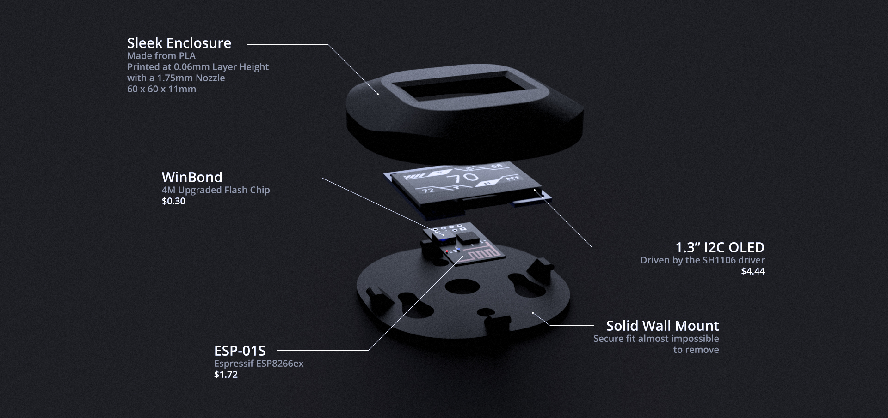

# Prerequisites
- A thermostat that works with Home Assistant
- Dark Sky Weather Sensor for Home Assistant
- VSCode with the PlatformIO Extension

# Parts List
- ESP-01 or ESP-01S
- 1.3" i2c OLED display
- Electrical Tape or some other non-conductive median
- Soldering Iron
- Solder
- 24 gauge solid core wire
- Needle Nose Pliers
- Desoldering pump or desoldering braid

# Assembly


> This project isn't for beginners. It requires a steady hand and patience. It also requires experience with soldering and desoldering.

### Header Removal

> I recommend setting your soldering iron to a temperature of 200-250°C for this part to prevent damage

1. Remove the black plastic part of the header pins on both the ESP-01 and the OLED
2. Remove each header pin on the ESP-01 and the OLED display by reflowing the solder on each pin while gently pulling the pin out with needle nose pliers
3. Remove remaining solder using a desoldering pump or desoldering braid

### Wiring The Parts

> I recommend setting your soldering iron to a temperature of 350-375°C for this part. Try not to apply heat to the pads for too long or you will risk damaging the device/pad.

1. Place electrical tape on the back of the OLED covering up the exposed components to prevent shorting
2. Solder a wire from the ESP-01's GND pin to the GND pin on the OLED and solder a wire that will go from GND on the OLED to GND on your power source
3. Solder a wire from the ESP-01's VCC pin to the VCC pin on the OLED and solder a wire that will go from VCC on the OLED to VCC on your power source
4. Solder a wire from the ESP-01's GPIO0 pin to the SDA pin on the OLED
5. Solder a wire from the ESP-01's GPIO2 pin to the SCL pin on the OLED
6. Place assembled components inside the 3d printed enclosure and use the soldering iron set to 200°C to melt the pegs in each corner of the display to firmly secure it in place

# Mounting

1. Thread the power wires through the center of the mounting plate
2. Use two drywall screws to mount the plate to the wall
3. Solder the power wires to the wires protruding out of the GND and VCC pins of the OLED display.
4. Wrap the exposed wires in electrical tape
5. The mounting plate has 4 pegs on it. Hook the bottom peg onto the bottom of the top assembly and firmly press on the top to get the top peg to snap into the top slot. This step takes a great deal of pressure. The case will bend while snapping each peg in place. This is normal and will not damage the hardware as long as the ESP module is flush against the back of the OLED display.

> Once fully assembled it is extremely hard to take apart so be sure you're absolutely sure you're ready to assemble it before assembling it.

# PlatformIO Setup
> If you upgraded your ESP-01's flash chip to 32MBits you will need a custom board file for PlatformIO.

Move `esp01_4m.json` to `%userprofile%\.platformio\boards\`

Rename `platformio.ini.example` to `platformio.ini`

# Configuration

Rename `lib/CORE/onfiguration.h.example` to `lib/CORE/configuration.h`

# 3D Printing
The case requires a print nozzle of 1.75mm due to it's size. For best results print slowly at 0.06mm layer height. The model was designed for a printer capable of printing with with 0.2mm of accuracy. Use enough support to handle the pegs the OLED will mount to. If done right you wont have to sand or paint the finished product.

# Home Assistant Configuration
### Customization
To make this easy turn debugging on in the devices configuration.h file and boot the device while looking at the serial monitor or the Remote Debugger. It will output the entity you need to use below.

```yaml
light.11cb27a45c71:
  friendly_name: Thermostat Display
```
> Replace `11cb27a45c71` with your display's MAC address (case sensitive)

### Automation Script
In order to get information to display on the device it needs to be told what to display. Below is the payload needed by the display. The trigger can be anything you want it to be. For example my personal one sends this payload every time one of my sensor nodes reports a temperature and if my thermostat state changes.
```yaml
- id: '1536963450591'
  alias: Update Thermostat
  trigger:
  - platform: time
    seconds: /10
  condition: []
  action:
  - service: mqtt.publish
    data:
      payload_template: >-
        {
            "time": {{ now().strftime('%s') }},
            "mode" : "{{state_attr("climate.thermostat", "operation_mode")}}",
            "status": "{{ states('climate.thermostat') }}",
            "target_temp": {{ state_attr('climate.thermostat','temperature') }},
            "indoor_temp": {{ state_attr('climate.thermostat', 'current_temperature') }},
            "outdoor_temp": {{ states('sensor.dark_sky_apparent_temperature') }},
            "condition_icon": "{{ states('sensor.dark_sky_icon') }}"
        }
      qos: 0
      topic: 11cb27a45c71/command
```
Replace `climate.thermostat` with your thermostat entity id

Replace `11cb27a45c71` with your display's MAC address (case sensitive)
