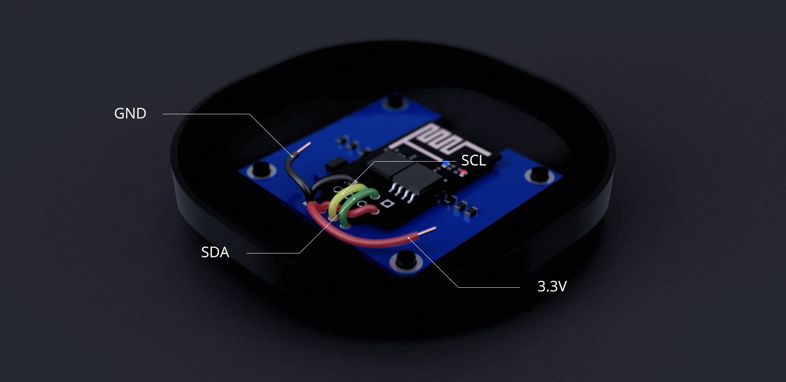

# Parts List
- ESP-01 or ESP-01S
- 1.3" i2c OLED display
- Electrical Tape or some other non-conductive median
- Soldering Iron
- Solder
- 22 Gauge Solid Core Wire
- Pliers
- Solder-Sucker/Desoldering braid

# Parts Assembly

## Header Removal

I recommend a temperature of 200-250°C for this part to prevent damage

1. Remove the black plastic part of the header pins on both the ESP-01 and the OLED
2. Remove the header pins on the ESP-01 and the OLED display by reflowing the solder on each pin while gently pulling the pin out with pliers
3. Clean up the holes using Solder-Sucker/Desoldering braid

## Assembling The Parts

I recommend a temperature of 350-375°C for this part try not to linger too long

1. Place electrical tape on the back of the OLED covering up the exposed components to prevent shorting
2. Solder a wire from the ESP-01's GND pin to the GND pin on the OLED and solder a wire that will go from GND on the OLED to GND on your power source
3. Solder a wire from the ESP-01's VCC pin to the VCC pin on the OLED and solder a wire that will go from VCC on the OLED to VCC on your power source
4. Solder a wire from the ESP-01's GPIO0 pin to the SDA pin on the OLED
5. Solder a wire from the ESP-01's GPIO2 pin to the SCL pin on the OLED

# PlatformIO Setup
If you upgraded your ESP-01's flash chip to 32MBits you will need a custom board file for PlatformIO.

Move `esp01_4m.json` to `%userprofile%\.platformio\boards\`

Rename `platformio.ini.example` to `platformio.ini`

# 3D Printing
The case requires a print nozzle of 1.75mm due to it's size. For best results print slowly at 0.06mm layer height. The model was designed for a printer capable of printing with with 0.2mm of accuracy.

# Home Assistant Configuration
## Customization
```yaml
light.11cb27a45c71:
  friendly_name: Thermostat Display
```
Replace `11cb27a45c71` with your display's MAC address (case sensitive)

## Automation Script
```yaml
- id: '1536963450591'
  alias: Update Thermostat
  trigger:
  - platform: time
    seconds: /10
  condition: []
  action:
  - service: mqtt.publish
    data:
      payload_template: >-
        {
            "time": {{ now().strftime('%s') }},
            "mode" : "{{state_attr("climate.thermostat", "operation_mode")}}",
            "status": "{{ states('climate.thermostat') }}",
            "target_temp": {{ state_attr('climate.thermostat','temperature') }},
            "indoor_temp": {{ state_attr('climate.thermostat', 'current_temperature') }},
            "outdoor_temp": {{ states('sensor.dark_sky_apparent_temperature') }},
            "condition_icon": "{{ states('sensor.dark_sky_icon') }}"
        }
      qos: 2
      topic: 11cb27a45c71/command
```
Replace `climate.thermostat` with your thermostat entity id

Replace `11cb27a45c71` with your display's MAC address (case sensitive)
